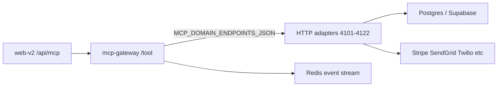

# Matex Environment Activation Guide

This guide explains each `.env` key category, where it is used in Matex, and how to activate it for both local development and production.

## Quick start

1. Local: copy `.env.local.example` to `.env.local`.
2. Production: use `.env.production.example` as your Railway/Vercel source.
3. Validate:
   - `pnpm validate-env` (local defaults)
   - `VALIDATE_ENV_TARGET=production VALIDATE_ENV_PROFILE=full pnpm validate-env` (strict production checks)
4. Health check:
   - `pnpm healthcheck` (defaults to `http://localhost:3001/health`)

## Runtime flow

## Key matrix (active vs reserved)

| Key | Local | Production | Status in code | Matex usage |
|---|---|---|---|---|
| `DATABASE_URL` | required | required | Active | Main DB connection for adapters and scripts |
| `JWT_SECRET` | required | required | Active | JWT signing/verification in gateway + adapter |
| `JWT_ACCESS_TOKEN_EXPIRY` | optional | recommended | Active | Access token expiry override (`15m` default) |
| `JWT_REFRESH_TOKEN_EXPIRY` | optional | recommended | Active | Refresh token expiry override (`7d` default) |
| `NEXT_PUBLIC_APP_URL` | recommended | required | Config/documentation | Canonical app URL for deploy config |
| `NEXT_PUBLIC_GATEWAY_URL` | required fallback | optional | Active | Browser/server fallback gateway origin |
| `MCP_GATEWAY_URL` | recommended | required | Active | Server-side `/api/mcp` gateway target |
| `MCP_DOMAIN_ENDPOINTS_JSON` | required for adapters | required | Active | Domain forwarding map (`auth`, `listing`, `escrow`, etc.) |
| `REDIS_URL` | optional | recommended | Active | ioredis stream/event bus (`rediss://...`) |
| `UPSTASH_REDIS_REST_URL` | optional | optional | Partially active | Optional fallback in some services |
| `UPSTASH_REDIS_REST_TOKEN` | optional | optional | Reserved | Companion token for REST usage |
| `NEXT_PUBLIC_SUPABASE_URL` | optional | recommended | Active | Supabase endpoint in server integrations |
| `NEXT_PUBLIC_SUPABASE_ANON_KEY` | optional | recommended | Active/readiness | Client-facing Supabase key |
| `SUPABASE_SERVICE_ROLE_KEY` | optional | recommended | Active | Server writes/storage signing (never browser) |
| `SUPABASE_DB_URL` | optional | optional | Reserved | Alias/documentation key (use `DATABASE_URL` runtime) |
| `STRIPE_SECRET_KEY` | optional | required for live pay | Active | Stripe bridge live mode |
| `STRIPE_PUBLISHABLE_KEY` | optional | recommended | Reserved | Frontend publishable key (future wiring) |
| `STRIPE_WEBHOOK_SECRET` | optional | recommended | Reserved | Webhook signature verification (future wiring) |
| `STRIPE_CONNECT_CLIENT_ID` | optional | recommended | Reserved | Stripe Connect auth (future wiring) |
| `SENDGRID_API_KEY` | optional | required for live email | Active | SendGrid bridge live mode |
| `SENDGRID_FROM_EMAIL` | optional | required for live email | Active | Email sender address |
| `SENDGRID_FROM_NAME` | optional | recommended | Active | Email sender display name |
| `TWILIO_ACCOUNT_SID` | optional | required for live SMS | Active | Twilio bridge credentials |
| `TWILIO_AUTH_TOKEN` | optional | required for live SMS | Active | Twilio bridge credentials |
| `TWILIO_PHONE_NUMBER` | optional | required for live SMS | Active | Twilio sender phone number |
| `GOOGLE_MAPS_API_KEY` | optional | optional | Reserved | Future maps/geocoding features |
| `DOCUSIGN_INTEGRATION_KEY` | optional | optional | Reserved | Future DocuSign integration |
| `DOCUSIGN_SECRET_KEY` | optional | optional | Reserved | Future DocuSign integration |
| `DOCUSIGN_ACCOUNT_ID` | optional | optional | Reserved | Future DocuSign integration |
| `DOCUSIGN_BASE_URL` | optional | optional | Reserved | Future DocuSign API base |
| `ONFIDO_API_TOKEN` | optional | optional | Reserved | Future Onfido KYC integration |
| `SENTRY_DSN` | optional | recommended | Validation/readiness | Error telemetry readiness key |
| `UI_RESET_SECRET` | optional | optional | Active in legacy API route | Protects UI test reset endpoint |
| `MATEX_DEV_SEED_EMAIL` | optional | n/a | Active | Persist local dev login across gateway restarts |
| `MATEX_DEV_SEED_PASSWORD` | optional | n/a | Active | Dev seeded user password |
| `MATEX_DEV_SEED_PHONE` | optional | n/a | Active | Dev seeded user phone |
| `MATEX_DEV_SEED_ACCOUNT_TYPE` | optional | n/a | Active | Dev seeded user account type |
| `MATEX_DEV_ADMIN_EMAILS` | optional | n/a | Active | Comma-separated dev platform admins |
| `NODE_ENV` | optional | required | Active | Runtime mode |
| `LOG_LEVEL` | optional | recommended | Config | Logging verbosity |

## Provider usage on Matex

- Supabase: backing datastore access in MCP servers/adapter, plus storage upload URL generation.
- Redis/Upstash: gateway and services event bus for tool routing/audit events.
- Stripe: payment intent/refund/transfer bridge (stub mode when key missing).
- SendGrid: transactional and template emails (stub mode when key missing).
- Twilio: SMS/OTP delivery (stub mode when keys missing).
- DocuSign/Onfido/Maps: predeclared for roadmap integrations; currently not hard-wired in runtime.
- Sentry: prepared as deploy key, pending deeper service instrumentation.

## Local activation checklist

- Copy `.env.local.example` to `.env.local`.
- Fill at least:
  - `DATABASE_URL`
  - `JWT_SECRET`
  - `MCP_GATEWAY_URL`
  - `NEXT_PUBLIC_GATEWAY_URL`
  - `MCP_DOMAIN_ENDPOINTS_JSON`
- Optional local convenience:
  - `MATEX_DEV_SEED_*`
  - `MATEX_DEV_ADMIN_EMAILS`
- Run:
  - `pnpm validate-env`
  - `pnpm dev:gateway`
  - `pnpm dev:http-adapters`
  - `pnpm dev:web-v2-stack`
  - `pnpm healthcheck`

## Production activation checklist

- Gateway + adapters:
  - `DATABASE_URL`, `JWT_SECRET`, `REDIS_URL`, `MCP_DOMAIN_ENDPOINTS_JSON`
  - `SENTRY_DSN` recommended
- Web:
  - `NEXT_PUBLIC_APP_URL`, `MCP_GATEWAY_URL`
  - Optional `NEXT_PUBLIC_GATEWAY_URL` mirror for consistency
- Providers:
  - `STRIPE_SECRET_KEY`, `SENDGRID_API_KEY`, `TWILIO_*`
  - Keep future keys populated if your ops policy requires one source-of-truth secrets inventory
- Run strict validation:
  - `VALIDATE_ENV_TARGET=production VALIDATE_ENV_PROFILE=full pnpm validate-env`
  - `HEALTHCHECK_URL=https://api.matexhub.ca/health pnpm healthcheck`

